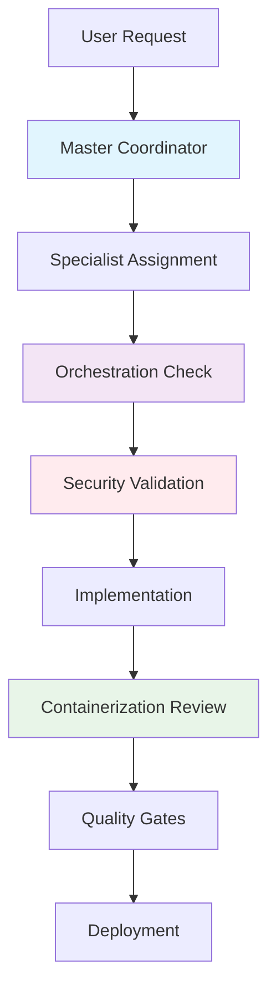
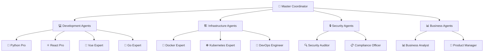
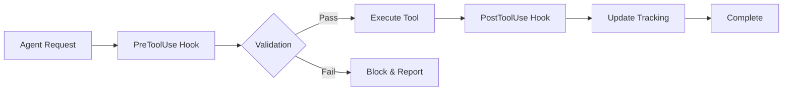
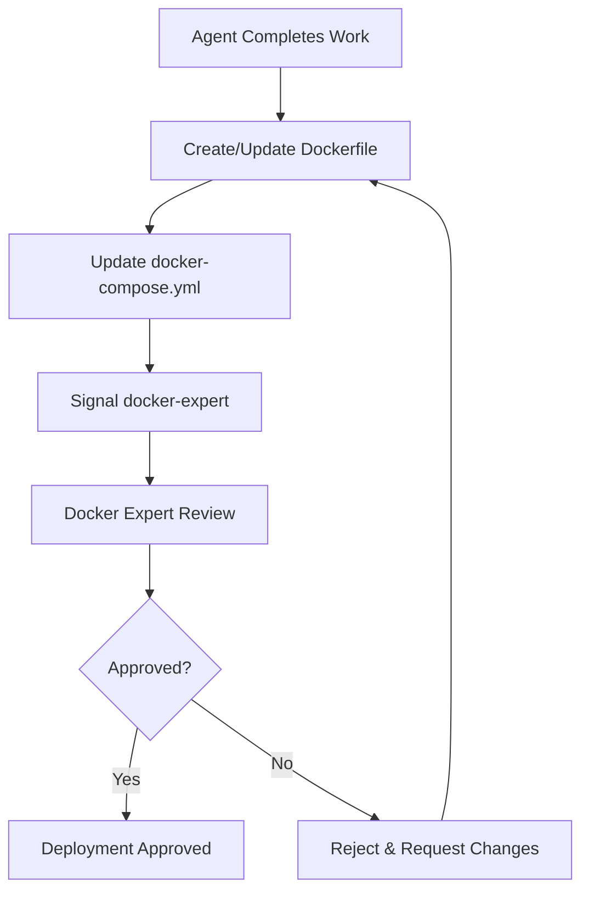

<div align="center">


# MEMENTO AI: When Your AI Has Amnesia 🧠💾align="center">


# MEMENTO AI: When Your AI Has Amnesia �💾

## �🤖 Claude Agents - Enterprise AI Development Ecosystem


### 🎬 *"Remember Sammy Jenkins... Remember Your Context Window"*

**What if I told you... your AI has the same problem as Leonard from Memento?**

Meet Leonard. He can't form new memories past 15 minutes. Now meet your AI - it can't remember anything past its context window. Both resort to desperate measures: Leonard uses tattoos and Polaroids, you copy-paste your entire conversation history like a digital hoarder.

**But what if Leonard had a photographic memory assistant?**

*Enter Claude Agents - Because your AI shouldn't forget you exist every 8,000 tokens.*

</div>

---

## 🧠 The Problem: AI Amnesia

```mermaid
graph LR
    A[💬 "Fix the login bug"] --> B[🤖 "What login? What app?"]
    B --> C[😤 Copy-paste entire context]
    C --> D[💬 "Remember: React app, Express backend, MongoDB..."]
    D --> E[🤖 "Oh right! Let me forget this in 5 minutes"]
    E --> A
    
    style A fill:#ffebee
    style B fill:#ffebee
    style E fill:#ffebee
```

**Sound familiar?** Every developer has been there:

- 🔄 **Explaining your project 47 times**: "It's a React app with Express backend..."
- 📋 **Copy-pasting context**: Your messages look like novels with backstory
- 🤦‍♂️ **AI Confidence vs Reality**: "As we discussed..." (Narrator: *They never discussed it*)
- 💾 **Digital Hoarding**: Saving every conversation because AI won't remember

---

## ⚡ The Solution: Persistent AI Memory

**Claude Agents** = Leonard with a photographic memory assistant

✨ **Project Memory**: Remembers your entire codebase, not just the last 20 messages
🔄 **Context Persistence**: Every conversation builds on the last  
🧩 **Smart Integration**: No more explaining your tech stack daily
🎯 **Specialized Expertise**: 50+ agents that remember their specializations
🔒 **Quality Enforcement**: Zero tolerance for "TODO" and placeholder code

*A comprehensive collection of specialized AI agents for enterprise software development with advanced orchestration, containerization, and quality enforcement*

</div>

---

## 🎬 The Viral Truth: Your AI is Leonard Shelby

### 🧠 The Amnesia Problem
```
Leonard's Problem:     Your AI's Problem:
┌─────────────────┐   ┌─────────────────┐
│ Memory: 15 min  │   │ Memory: 8K tokens│ 
│ Method: Tattoos │   │ Method: Copy-paste│
│ Tool: Polaroids │   │ Tool: Screenshots│
│ Phrase: "Don't  │   │ Phrase: "As we   │
│  believe lies"  │   │  discussed..."   │
└─────────────────┘   └─────────────────┘
```

### 💡 The Desperate Measures
**Leonard:** *Frantically checking tattoos and photos*
```
"Remember Sammy Jankis"
"Don't trust his lies"  
"She's the one"
```

**You with AI:** *Copy-pasting context like a digital hoarder*
```
"Remember: my name is John, I like pizza, we're building 
a React app with Express backend, using MongoDB, we already 
tried that solution, my birthday is next week, and we're 
deploying on AWS..."
```

### 🚀 The Claude Agents Solution

**What if Leonard had persistent memory?** 🤔

Instead of tattoos → **Project Memory Database**
Instead of Polaroids → **Context Persistence Engine**  
Instead of sticky notes → **Smart Agent Coordination**

---

## 📋 Table of Contents

- [� The Viral Truth](#-the-viral-truth-your-ai-is-leonard-shelby)
- [🧠 The Problem: AI Amnesia](#-the-problem-ai-amnesia)
- [⚡ The Solution: Persistent AI Memory](#-the-solution-persistent-ai-memory)
- [�🎯 Overview](#-overview)
- [🏗️ Architecture](#️-architecture)
- [🤖 Agent Categories](#-agent-categories)
- [🔧 Installation](#-installation)
- [🚀 Quick Start](#-quick-start)
- [📖 Usage Guide](#-usage-guide)
- [🎣 Hooks System](#-hooks-system)
- [🔒 Security & Compliance](#-security--compliance)
- [📊 Orchestration Framework](#-orchestration-framework)
- [🐳 Containerization](#-containerization)
- [📚 Documentation](#-documentation)
- [🤝 Contributing](#-contributing)

---

## 🔄 Before vs After: The Leonard Transformation

### 😵 **WITHOUT Claude Agents (Living in Memento)**

```mermaid
sequenceD​iagram
    participant Dev as Developer
    participant AI as Generic AI
    
    Dev->>AI: "Fix the authentication bug"
    AI->>Dev: "What app? What authentication?"
    Dev->>AI: "React app, we talked about this yesterday..."
    AI->>Dev: "I don't recall. Can you provide context?"
    Dev->>AI: "🤦‍♂️ *copies entire conversation history*"
    AI->>Dev: "Oh right! *forgets again in 10 minutes*"
```

**The Struggle:**
- 📋 Every conversation starts from scratch
- 🔄 Repeating project context endlessly  
- 💾 Copy-pasting like Leonard checking tattoos
- 😤 AI confidently wrong about past discussions

### ✨ **WITH Claude Agents (Leonard with Perfect Memory)**

```mermaid
sequenceD​iagram
    participant Dev as Developer
    participant CA as Claude Agents
    
    Dev->>CA: "Fix the authentication bug"
    CA->>CA: *Checks project memory*
    CA->>Dev: "I see the JWT issue in auth.js line 247 we discussed"
    CA->>CA: *Coordinates with security-auditor*
    CA->>Dev: "Fixed + security scan complete + containerized"
```

**The Power:**
- 🧠 **Persistent Memory**: Remembers your entire project
- 🎯 **Specialized Expertise**: Right agent for every task
- 🔄 **Smart Coordination**: Agents work together seamlessly
- 🐳 **Quality Enforcement**: No shortcuts, no placeholders

---

## 🎯 Overview

The **Claude Agents** system is an enterprise-grade AI development ecosystem that provides 50+ specialized agents for comprehensive software development workflows. Each agent is designed with specific expertise, built-in orchestration capabilities, and mandatory containerization requirements.

### ✨ Key Features

- 🎯 **50+ Specialized Agents** - From Python development to DevOps, security, and UX design
- 🔄 **Advanced Orchestration** - Automated coordination between agents with collision avoidance
- 🐳 **Mandatory Containerization** - All deliverables must be containerized (zero exceptions)
- 🎣 **Intelligent Hooks System** - Pre/post execution validation and automation
- 🔐 **Security-First Design** - Built-in security scanning and compliance validation
- 📊 **Real-time Collaboration** - File locking and status tracking for multi-agent workflows
- ⚡ **Zero Tolerance Policy** - No placeholder code, mock data, or fake implementations allowed

### 🎭 Agent Philosophy



---

## 🏗️ Architecture

### System Components

```
📁 claude_agents/
├── 🤖 agents/               # 50+ Specialized AI Agents
│   ├── 🐍 python-pro.md
│   ├── ⚛️ react-pro.md
│   ├── 🐳 docker-expert.md
│   ├── 🔒 security-auditor.md
│   └── ... (46 more)
├── 🎣 hooks/                # Automation & Validation Hooks
│   ├── 📋 master-settings.json
│   ├── 🐍 python-agent-hooks.py
│   ├── 🌐 frontend-agent-hooks.py
│   └── ... (12 more)
├── 📊 orchestration-index_template.md
├── 📋 WORK_STATUS_template.md
└── 🚀 HOOKS_EXAMPLE_WORKFLOW.md
```

### Agent Hierarchy



---

## 🤖 Agent Categories

### 🐍 **Backend Development (12 Agents)**
| Agent | Expertise | Key Features |
|-------|-----------|--------------|
| 🐍 `python-pro` | Advanced Python, FastAPI, Django | Async programming, performance optimization |
| ⚡ `fastapi-expert` | FastAPI, REST APIs, Pydantic | High-performance API development |
| 🐍 `django-expert` | Django, ORM, full-stack | Enterprise web applications |
| ☕ `java-expert` | Spring Boot, microservices | Enterprise Java development |
| 🔵 `go-expert` | Go, concurrency, microservices | High-performance backend services |
| 🦀 `rust-expert` | Rust, systems programming | Memory-safe, high-performance systems |
| 🔶 `node-js-expert` | Node.js, Express, real-time | JavaScript backend development |
| 🏗️ `backend-architect` | System design, architecture | Scalable backend architecture |

### 🌐 **Frontend Development (8 Agents)**
| Agent | Expertise | Key Features |
|-------|-----------|--------------|
| ⚛️ `react-pro` | React, hooks, state management | Modern React development |
| 💚 `vue-expert` | Vue.js, Nuxt, composition API | Vue ecosystem mastery |
| 🔺 `angular-expert` | Angular, TypeScript, RxJS | Enterprise Angular applications |
| 🌟 `frontend-specialist` | HTML5, CSS3, JavaScript | Core frontend technologies |
| 📱 `ui-ux-designer` | User experience, design systems | Interface design and usability |
| 🎨 `content-strategist` | Content design, copywriting | User-focused content creation |

### 🏗️ **Infrastructure & DevOps (10 Agents)**
| Agent | Expertise | Key Features |
|-------|-----------|--------------|
| 🐳 `docker-expert` | Containerization, image optimization | **MANDATORY GATEKEEPER** |
| ☸️ `kubernetes-expert` | K8s, orchestration, scaling | Container orchestration |
| 🔧 `devops-engineer` | CI/CD, automation, monitoring | Infrastructure automation |
| 🌍 `terraform-expert` | Infrastructure as Code | Cloud infrastructure management |
| ☁️ `google-architect` | GCP, cloud-native design | Google Cloud solutions |
| 📊 `monitoring-specialist` | Observability, alerting | System monitoring and metrics |
| 🚨 `incident-responder` | Crisis management, debugging | Production incident handling |
| ⚡ `performance-optimizer` | System optimization, tuning | Performance analysis and optimization |

### 🔒 **Security & Compliance (4 Agents)**
| Agent | Expertise | Key Features |
|-------|-----------|--------------|
| 🔍 `security-auditor` | Vulnerability assessment, pentesting | Security analysis and hardening |
| 📋 `compliance-officer` | Regulatory compliance, audits | Legal and regulatory adherence |
| 🛡️ `network-engineer` | Network security, protocols | Network architecture and security |

### 💾 **Data & AI (6 Agents)**
| Agent | Expertise | Key Features |
|-------|-----------|--------------|
| 🧠 `ai-engineer` | ML/AI, model deployment | Machine learning and AI systems |
| 📊 `data-scientist` | Data analysis, modeling | Data science and analytics |
| 🗄️ `database-architect` | Schema design, optimization | Database design and performance |
| 📈 `data-engineer` | ETL, data pipelines | Data infrastructure and processing |

### 📱 **Mobile Development (2 Agents)**
| Agent | Expertise | Key Features |
|-------|-----------|--------------|
| 📱 `mobile-developer` | iOS, Android, cross-platform | Mobile application development |

### 🎮 **Game Development (2 Agents)**
| Agent | Expertise | Key Features |
|-------|-----------|--------------|
| 🎮 `game-developer` | Unity, Unreal, game mechanics | Game development and design |

### 📊 **Business & Management (6 Agents)**
| Agent | Expertise | Key Features |
|-------|-----------|--------------|
| 📊 `business-analyst` | Requirements analysis, modeling | Business process analysis |
| 👔 `product-manager` | Product strategy, roadmaps | Product planning and management |
| 🎯 `project-coordinator` | Project management, coordination | Project planning and execution |
| 📝 `scrum-master` | Agile, scrum, team coordination | Agile methodology expertise |
| ✍️ `technical-writer` | Documentation, technical content | Technical documentation |

---

## 🔧 Installation

### Prerequisites

- **Claude Code** (Desktop application)
- **Python 3.11+** (for hooks system)
- **Docker** (mandatory for all deliverables)
- **Git** (for version control)

### Step 1: Clone the Repository

```bash
git clone https://github.com/rhahn28/Claude_Agents.git
cd Claude_Agents
```

### Step 2: Set Up Claude Code Integration

1. **Open Claude Code**
2. **Navigate to Settings** → **Extensions** → **Custom Agents**
3. **Add Agent Directory**: Point to the `agents/` folder
4. **Configure Hooks**: Set hooks directory to `hooks/`

### Step 3: Configure Hooks System

```bash
# Set up Python environment for hooks
pip install -r hooks/requirements.txt

# Copy master settings to Claude config
cp hooks/master-settings.json ~/.claude/settings.json
```

### Step 4: Verify Installation

```bash
# Test hooks system
python hooks/test-hooks-demo.py

# Verify agent availability
ls agents/ | wc -l  # Should show 50+ agents
```

---

## 🚀 Quick Start

### 🎯 Basic Agent Usage

1. **Start Claude Code**
2. **Select an Agent** from the agent picker
3. **Begin your conversation** - the agent will automatically:
   - ✅ Read orchestration context
   - ✅ Check file locks
   - ✅ Apply security validations
   - ✅ Ensure containerization requirements

### 🏃‍♂️ Quick Example: Python API Development

```bash
# 1. Select python-pro agent
# 2. Request: "Create a FastAPI user management API"
# 3. Agent automatically:
#    - Creates orchestration files
#    - Implements the API
#    - Creates Dockerfile
#    - Signals docker-expert for review
#    - Updates work status
```

### 📊 Orchestration Templates

```bash
# Create new project orchestration
cp orchestration-index_template.md orchestration-index.md
cp WORK_STATUS_template.md WORK_STATUS.md

# Edit with your project details
# Agents will automatically read and update these files
```

---

## 📖 Usage Guide

### 🎭 Multi-Agent Workflow Example

```mermaid
sequenceD​iagram
    participant User
    participant MC as Master Coordinator
    participant PY as Python Pro
    participant FE as React Pro
    participant DE as Docker Expert
    participant DevOps as DevOps Engineer

    User->>MC: "Build a user management system"
    MC->>MC: Create orchestration files
    MC->>PY: "Implement backend API"
    PY->>PY: Check WORK_STATUS.md
    PY->>PY: Implement FastAPI service
    PY->>DE: Signal for containerization review
    DE->>DE: Create/validate Dockerfile
    DE->>PY: Approve containerization
    MC->>FE: "Create React frontend"
    FE->>FE: Check for API completion
    FE->>FE: Implement React components
    FE->>DE: Signal for containerization review
    DE->>DevOps: Deploy to staging
    DevOps->>User: System deployed
```

### 🔄 Agent Communication Protocols

#### 📋 File Locking System
```markdown
# WORK_STATUS.md Example
## File Locks
- `src/api.py` - LOCKED by python-pro (2025-09-05 14:23:15)
- `src/components/` - LOCKED by react-pro (2025-09-05 14:25:30)

## Task Queue
- [ ] Database schema design - ASSIGNED: database-architect
- [ ] Security audit - PENDING: security-auditor
- [x] API implementation - COMPLETED: python-pro
```

#### 📊 Orchestration Index
```markdown
# orchestration-index.md Example
## Project: User Management System
### Phase 1: Backend Development ✅
- API endpoints implemented
- Database schema created
- Authentication system added

### Phase 2: Frontend Development 🚧
- React components in progress
- State management implemented
- UI/UX review pending

### Phase 3: Deployment 📋
- Containerization completed
- CI/CD pipeline pending
```

---

## 🎣 Hooks System

The hooks system provides automated validation, coordination, and quality enforcement.

### 🔄 Hook Execution Flow



### 🎯 Available Hooks

| Hook | Purpose | Triggers |
|------|---------|----------|
| 🐍 `python-agent-hooks.py` | Python validation, environment checks | Python agents |
| 🌐 `frontend-agent-hooks.py` | Frontend validation, accessibility | Frontend agents |
| 🏗️ `infrastructure-agent-hooks.py` | Infrastructure validation | DevOps agents |
| 🔒 `security-agent-hooks.py` | Security scanning, compliance | Security agents |
| 💾 `database-agent-hooks.py` | Schema validation, migrations | Database agents |
| 📊 `business-agent-hooks.py` | Requirements traceability | Business agents |
| 🧪 `testing-agent-hooks.py` | Test coverage, quality | Testing agents |
| 📱 `mobile-agent-hooks.py` | Mobile optimization | Mobile agents |
| 🎮 `game-agent-hooks.py` | Game mechanics validation | Game agents |
| 🧠 `data-ai-agent-hooks.py` | ML model validation | AI/Data agents |
| 🎨 `creative-agent-hooks.py` | Design system compliance | Creative agents |

### 🔧 Hook Configuration

```json
// master-settings.json
{
  "claude.hooks": {
    "PreToolUse": [
      {
        "command": "python",
        "args": ["hooks/python-agent-hooks.py"],
        "condition": {
          "agentName": ["python-pro", "django-expert", "fastapi-expert"]
        }
      }
    ]
  }
}
```

### 📝 Example Hook Execution

```bash
# Before file write operation
[HOOK] Checking containerization requirements...
[HOOK] ✅ Dockerfile found
[HOOK] ✅ docker-compose.yml updated
[HOOK] ✅ Security scan passed
[HOOK] 🚨 CRITICAL: Requesting user confirmation

# After successful operation
[HOOK] 📝 Updating WORK_STATUS.md
[HOOK] 📊 Updating orchestration-index.md
[HOOK] 🐳 Signaling docker-expert for review
[HOOK] ✅ Operation completed successfully
```

---

## 🔒 Security & Compliance

### 🛡️ Security Features

- **🔍 Automated Security Scanning** - All code automatically scanned
- **🚫 Zero Tolerance Policy** - No placeholder or mock implementations
- **🔐 Secret Detection** - Prevents accidental secret commits
- **📋 Compliance Validation** - GDPR, SOC2, HIPAA compliance checks
- **🔒 Access Control** - Role-based file access and modifications

### 📋 Compliance Standards

| Standard | Agent | Validation |
|----------|-------|------------|
| 🔒 SOC 2 | `compliance-officer` | Access controls, audit logs |
| 🏥 HIPAA | `compliance-officer` | Data encryption, privacy |
| 💳 PCI DSS | `security-auditor` | Payment data protection |
| 🌍 GDPR | `compliance-officer` | Data privacy, consent |
| 🔐 OWASP | `security-auditor` | Web application security |

### 🚨 Security Enforcement

```python
# Example security validation
def validate_security(file_content):
    issues = []
    
    # Check for secrets
    if detect_secrets(file_content):
        issues.append("🚨 CRITICAL: Secrets detected")
    
    # Check for vulnerabilities
    if scan_vulnerabilities(file_content):
        issues.append("⚠️ WARNING: Vulnerabilities found")
    
    # Check for compliance
    if not check_compliance(file_content):
        issues.append("📋 COMPLIANCE: Standards not met")
    
    return issues
```

---

## 📊 Orchestration Framework

### 🎯 Core Orchestration Files

#### 📋 `WORK_STATUS.md` - Real-time Coordination
```markdown
# Work Status - Live Coordination

## 🔒 Active File Locks
| File | Agent | Timestamp | Status |
|------|-------|-----------|---------|
| `src/api.py` | python-pro | 2025-09-05 14:23:15 | 🚧 ACTIVE |
| `src/components/` | react-pro | 2025-09-05 14:25:30 | 🚧 ACTIVE |

## 📋 Task Queue
### 🚧 In Progress
- Backend API implementation - `python-pro`
- Frontend components - `react-pro`

### 📅 Pending
- Security audit - `security-auditor`
- Performance optimization - `performance-optimizer`

### ✅ Completed
- Project setup - `master-coordinator`
- Database schema - `database-architect`

## 🐳 Containerization Status
| Service | Dockerfile | docker-compose | Review Status |
|---------|-----------|----------------|---------------|
| API | ✅ Created | ✅ Updated | 🔄 Pending |
| Frontend | ❌ Missing | ❌ Missing | ❌ Not Ready |

## 🚨 Alerts & Notifications
- 🔴 CRITICAL: API service needs docker-expert review
- 🟡 WARNING: Frontend containerization required
```

#### 📊 `orchestration-index.md` - Project Overview
```markdown
# Project Orchestration Index

## 📋 Project: Enterprise User Management System

### 🎯 Project Overview
**Objective**: Build scalable user management system with React frontend and FastAPI backend

**Timeline**: 2 weeks
**Priority**: HIGH
**Compliance**: SOC2, GDPR required

### 🏗️ Architecture Decisions
- **Backend**: FastAPI + PostgreSQL
- **Frontend**: React + TypeScript
- **Deployment**: Kubernetes on GCP
- **Monitoring**: Prometheus + Grafana

### 📊 Progress Tracking

#### Phase 1: Backend Development (80% Complete)
- [x] Database schema design - `database-architect`
- [x] API endpoints - `python-pro`
- [x] Authentication system - `python-pro`
- [ ] Security audit - `security-auditor`

#### Phase 2: Frontend Development (30% Complete)
- [x] Component architecture - `react-pro`
- [ ] State management - `react-pro`
- [ ] UI/UX review - `ui-ux-designer`

#### Phase 3: DevOps & Deployment (10% Complete)
- [x] Containerization review - `docker-expert`
- [ ] CI/CD pipeline - `devops-engineer`
- [ ] Monitoring setup - `monitoring-specialist`

### 🔄 Agent Assignments
| Agent | Current Task | Priority | ETA |
|-------|--------------|----------|-----|
| `python-pro` | API optimization | HIGH | 2 hours |
| `react-pro` | Component implementation | MEDIUM | 1 day |
| `security-auditor` | Security review | CRITICAL | 4 hours |

### 📊 Metrics & KPIs
- **API Response Time**: <100ms target
- **Test Coverage**: >90% required
- **Security Score**: A+ required
- **Performance Score**: >95 required
```

### 🔄 Agent Coordination Example

```python
# Automatic coordination workflow
class AgentCoordinator:
    def assign_task(self, task, required_agents):
        # 1. Check dependencies
        dependencies = self.check_dependencies(task)
        
        # 2. Lock required files
        locked_files = self.lock_files(task.files)
        
        # 3. Assign to appropriate agent
        agent = self.select_best_agent(required_agents)
        
        # 4. Update orchestration
        self.update_work_status(task, agent)
        self.update_orchestration_index(task, agent)
        
        # 5. Monitor progress
        return self.monitor_task(task, agent)
```

---

## 🐳 Containerization

### 🚨 MANDATORY Containerization Policy

**⚠️ CRITICAL**: ALL work MUST be containerized - **ZERO EXCEPTIONS**

- 🐳 **Docker Expert** = Mandatory gatekeeper
- 📋 **All agents** must create/update Dockerfiles
- ✅ **No deployment** without containerization approval
- 🔄 **docker-compose.yml** must be updated for all services

### 🔧 Containerization Workflow



### 📋 Example Docker Configuration

```dockerfile
# Python service Dockerfile
FROM python:3.11-slim

WORKDIR /app

# Security: Create non-root user
RUN adduser --disabled-password --gecos '' appuser

# Install dependencies
COPY requirements.txt .
RUN pip install --no-cache-dir -r requirements.txt

# Copy application
COPY . .
RUN chown -R appuser:appuser /app

USER appuser

# Health check
HEALTHCHECK --interval=30s --timeout=3s --start-period=5s --retries=3 \
  CMD curl -f http://localhost:8000/health || exit 1

EXPOSE 8000
CMD ["uvicorn", "main:app", "--host", "0.0.0.0", "--port", "8000"]
```

```yaml
# docker-compose.yml
version: '3.8'

services:
  api:
    build: ./backend
    ports:
      - "8000:8000"
    environment:
      - DATABASE_URL=postgresql://user:pass@db:5432/myapp
    depends_on:
      - db
    healthcheck:
      test: ["CMD", "curl", "-f", "http://localhost:8000/health"]
      interval: 30s
      timeout: 10s
      retries: 3

  frontend:
    build: ./frontend
    ports:
      - "3000:3000"
    depends_on:
      - api

  db:
    image: postgres:15
    environment:
      POSTGRES_DB: myapp
      POSTGRES_USER: user
      POSTGRES_PASSWORD: pass
    volumes:
      - postgres_data:/var/lib/postgresql/data

volumes:
  postgres_data:
```

---

## 📚 Documentation

### 📖 Agent Documentation Structure

Each agent includes comprehensive documentation:

```markdown
---
name: agent-name
description: Brief description
tools: Available tools
color: Theme color
---

## CORE CAPABILITIES
- Detailed capability list

## APPROACH
- Development methodology

## ORCHESTRATION REQUIREMENTS
- Coordination protocols

## CONTAINERIZATION REQUIREMENTS
- Docker requirements

## ZERO TOLERANCE POLICY
- Quality standards
```

### 📋 Workflow Documentation

1. **📊 Orchestration Index** - Project overview and progress
2. **📋 Work Status** - Real-time coordination and file locks
3. **🎣 Hooks Logs** - Execution logs and validation results
4. **🔍 Security Reports** - Vulnerability scans and compliance
5. **📈 Performance Metrics** - System performance and optimization

---

## 🤝 Contributing

### 🎯 Contributing Guidelines

1. **🔄 Follow Orchestration** - Read orchestration-index.md first
2. **🔒 Use File Locks** - Check WORK_STATUS.md before modifications
3. **🐳 Containerize Everything** - All changes must be containerized
4. **🧪 Test Thoroughly** - 90%+ test coverage required
5. **📋 Document Changes** - Update relevant documentation

### 🛠️ Development Workflow

```bash
# 1. Fork and clone
git clone https://github.com/yourusername/Claude_Agents.git
cd Claude_Agents

# 2. Create feature branch
git checkout -b feature/new-agent

# 3. Follow agent template
cp agents/template.md agents/your-new-agent.md

# 4. Create corresponding hook
cp hooks/template-hook.py hooks/your-agent-hooks.py

# 5. Test your changes
python hooks/test-hooks-demo.py

# 6. Submit pull request
git push origin feature/new-agent
```

### 📋 Pull Request Template

```markdown
## 🎯 Description
Brief description of changes

## 🤖 Agent Changes
- [ ] New agent created/modified
- [ ] Hooks updated
- [ ] Tests added
- [ ] Documentation updated

## 🐳 Containerization
- [ ] Dockerfile created/updated
- [ ] docker-compose.yml updated
- [ ] Docker expert review completed

## 🧪 Testing
- [ ] Unit tests pass
- [ ] Integration tests pass
- [ ] Security scan clean
- [ ] Performance acceptable

## 📋 Checklist
- [ ] Follows orchestration protocols
- [ ] Zero tolerance policy enforced
- [ ] Documentation updated
- [ ] Backward compatibility maintained
```

---

## 📊 Statistics

### 📈 Agent Distribution

```
Development:     22 agents (44%)
Infrastructure:  10 agents (20%)
Business:         8 agents (16%)  
Security:         4 agents (8%)
Data/AI:          6 agents (12%)
```

### 🎯 Coverage Areas

- ✅ **Backend Development** - 12 languages/frameworks
- ✅ **Frontend Development** - 8 modern frameworks
- ✅ **Infrastructure** - Full DevOps lifecycle
- ✅ **Security** - Comprehensive security coverage
- ✅ **Data & AI** - Complete data science pipeline
- ✅ **Mobile** - Cross-platform development
- ✅ **Business** - Full project lifecycle

---

## 📞 Support

### 🔗 Quick Links

- 📖 [Documentation](./docs/)
- 🐛 [Issue Tracker](https://github.com/rhahn28/Claude_Agents/issues)
- 💬 [Discussions](https://github.com/rhahn28/Claude_Agents/discussions)
- 🚀 [Examples](./examples/)

### 📧 Contact

- **Author**: rhahn28
- **Repository**: [Claude_Agents](https://github.com/rhahn28/Claude_Agents)
- **License**: MIT

---

<div align="center">

**🚀 Ready to revolutionize your development workflow with AI agents?**

### 🔥 **Stop Living in Memento - Try Claude Agents**

Remember Everything. Build Anything. *No Tattoos Required.*

[](./docs/getting-started.md)
[](./agents/)
[](./docs/)

### 📱 **Share the AI Memory Revolution**

```
🔥 Viral Elements:
#MementoAI #ContextWindowProblems #ClaudeCode #AIAmnesia #DevLife
"OMG this is literally me with ChatGPT" 😂
```

**Key Comparisons:**
- Leonard's wall of notes = Your terminal full of context reminders
- Tattoo needle = Your desperate copy-paste actions  
- Polaroid photos = Your screenshot management chaos
- "Remember Sammy Jankis" = "Remember we're using React"

</div>

---

*Last updated: September 5, 2025*
*Version: 1.0.0*
*Status: Production Ready* ✅
